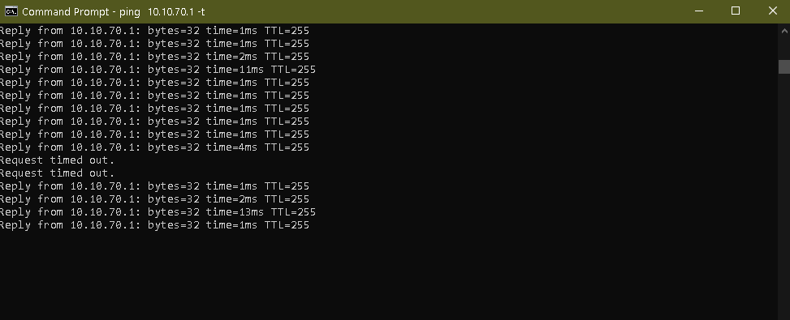
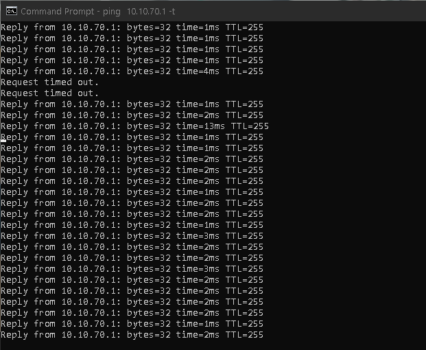
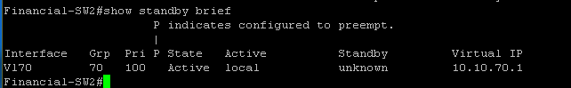
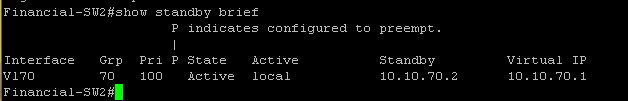

# HA/Failover Lab — Cherwood Financial

**Division:** Cherwood Financial (Cherwood Corporation portfolio)
**Status:** Complete — technical build and live failure test verified
**Protocol:** HSRP (Cisco), with Spanning Tree root alignment
**Hardware:** Two Cisco Catalyst 3560E switches in a live active/standby pair

---

## Why this project exists

Every other project in this portfolio proves segmentation, automation, or wireless design — none of them prove **redundancy under real failure**. Uptime-critical design is explicitly expected knowledge for Network Engineer roles, and a network with a single point of failure at the gateway layer is a real, common failure mode in production environments.

Cherwood Financial exists as a division specifically because "seconds of downtime = real money lost" is an intuitive, recognizable framing for why first-hop redundancy matters — more so than a generic "redundancy is good practice" pitch.

This project is deliberately scoped as a **verified, working implementation**, not a differentiator: HSRP is a well-known, CCNA-level protocol. The value here isn't novelty — it's a real two-device failover, cabled and tested against an actual power-pull, with a measured result.

## Architecture

```
                         10.10.70.0/24 (VLAN 70 — Financial)
                                    |
                    Virtual IP: 10.10.70.1  (HSRP Group 70)
                    /                                    \
        ┌───────────────────┐                  ┌───────────────────┐
        │   Cherwood-3560E   │◄──── Trunk ─────►│   Financial-SW2    │
        │   (Primary)        │   Gi0/7 ↔ Gi0/1  │   (Spare)           │
        │   10.10.70.2        │  VLANs 10, 70    │   10.10.70.3        │
        │   Priority: 150     │                  │   Priority: 100     │
        │   HSRP: Active      │                  │   HSRP: Standby     │
        │   STP: Root         │                  │   STP: Root Sec.    │
        └───────────────────┘                  └───────────────────┘
```

| Component | Value |
|---|---|
| VLAN | 70 (Financial) |
| Subnet | `10.10.70.0/24` |
| Virtual IP | `10.10.70.1` |
| HSRP Group | 70 |
| Primary priority | 150 (Active) |
| Spare priority | 100 (Standby) |
| Preemption | Disabled (deliberate) |
| Hello / Hold timers | 1s / 3s (tuned down from HSRP defaults of 3s/10s) |
| STP root (VLAN 70) | Primary (`root primary`) |
| STP root secondary | Spare (`root secondary`) |

## Design decisions worth explaining

**No preemption, deliberately.** Once the Standby switch takes over Active during a failure, it stays Active even after the original (higher-priority) switch comes back online. The alternative — automatic preemption — means every time the primary switch reboots or reconnects, the network re-converges again, which is its own brief disruption. Trading "always run on the preferred device" for "don't cause a second disruption every time the primary comes back" was a deliberate choice, not an oversight, and it's provable: see the failure test results below.

**Tuned HSRP timers.** Default HSRP timers (3s hello / 10s hold) mean up to 10 seconds of potential downtime before failover triggers. Tuning to 1s/3s trades a small amount of extra keepalive chatter for a much faster failure-detection window — an appropriate trade for a "seconds of downtime = money lost" scenario.

**STP root aligned to the HSRP Active switch.** Without this, it's possible for the Layer 3 Active gateway and the Layer 2 Spanning Tree root to be two different physical switches — meaning traffic could take a longer, indirect L2 path to reach the "correct" gateway even though L3 failover works fine. Explicitly setting `root primary` / `root secondary` to match the HSRP roles keeps the L2 and L3 topology aligned.

**Real two-device failover, not simulated.** The spare switch is a genuinely separate physical Cisco 3560E, cabled in parallel to the primary via a dedicated trunk, with its own management IP, its own SSH access for the automation toolkit, and its own SVI participating in the same HSRP group. Pulling power on the primary is a real hardware failure, not a config toggle.

## The failure test

1. A client (`10.10.70.50`) was connected to an access port on the spare switch and set to use the virtual IP (`10.10.70.1`) as its gateway.
2. A continuous ping to the VIP was started and confirmed stable (1–5ms replies).
3. Power was physically pulled on the primary switch (the HSRP Active device at the time).
4. Result: 2 consecutive dropped pings — approximately 2 seconds of interruption — before replies resumed automatically, with no manual intervention. (Later re-measured precisely via Wireshark packet timestamps at 3.33 seconds — see the [Packet Capture Casebook](https://github.com/taruncherukurigit/packet-capture-casebook) for the raw capture and full breakdown.)
5. `show standby brief` on the spare switch confirmed it had assumed the Active role, with the primary showing as unreachable.
6. Power was restored to the primary. Once it rejoined, `show standby brief` confirmed it correctly reassumed **Standby** — not Active — despite its higher configured priority, proving the no-preemption design worked exactly as intended.

The original ~2 second stopwatch measurement was a reasonable human-reaction-time estimate. A later packet-level re-measurement (Wireshark, real timestamps) puts the actual failover at 3.33 seconds — matching the configured 3-second hold timer almost exactly, as expected, since the hold timer is the upper bound before failover triggers.

**Evidence:**

Continuous ping to the VIP, showing the exact moment of interruption and automatic recovery:



Stable, continuous replies afterward — confirming this wasn't a one-off blip:



`show standby brief` on the spare switch, confirming it assumed the Active role:



`show standby brief` on the primary after power was restored, confirming it correctly rejoined as Standby — not Active — despite its higher priority:



## Real bugs encountered

See [`TROUBLESHOOTING-LOG.md`](./TROUBLESHOOTING-LOG.md) for the full write-up. Three genuine issues were hit and resolved during this build — a firewall address-object scoping gap, a legacy IOS SSH limitation, and a fixed-width CLI parsing bug in the existing Topology Discovery pipeline that this project's new hardware exposed.

## Integration with existing infrastructure

This project extended two already-shipped systems rather than standing alone:

- **Network Automation Toolkit** — the spare switch (`Financial-SW2`) was added to `inventory.py`, so nightly backup and drift-detection automatically cover it, using password-based auth (see troubleshooting log for why key-based auth wasn't available on this device).
- **Automated Topology Discovery** — LLDP was enabled on the new inter-switch link, and the new physical connection is now visible on the live topology diagram at `netmap.tarunc.com`, generated the same way as every other link in the network.

## Verification performed

- Confirmed VLAN 70 trunk up and agreeing on both switches (`show interfaces trunk`)
- Confirmed HSRP state on both switches independently, before and after the failure test
- Confirmed STP root election matches the intended HSRP Active switch
- Confirmed a real client on VLAN 70 could reach the VIP as a functioning default gateway
- Executed a real power-pull failure test with continuous ping evidence
- Confirmed clean, non-flapping rejoin of the original switch as Standby post-recovery
- Confirmed the new link is correctly represented in the automated topology pipeline

---

**Related:** [Packet Capture Casebook](https://github.com/taruncherukurigit/packet-capture-casebook) — the packet-level re-measurement of this failover, plus SSL-VPN, LLDP, and DMZ segmentation captures from other divisions.

Part of the Cherwood Corporation portfolio — Cherwood Financial division.
